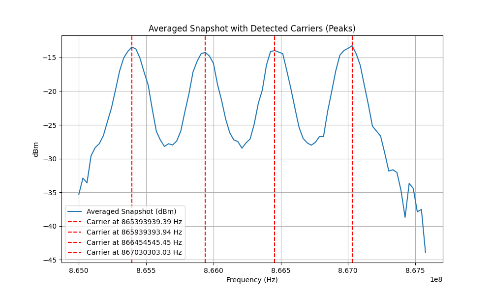
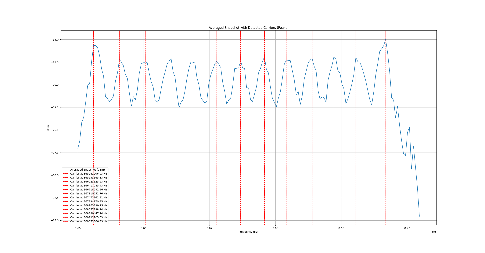

## TinySA Ultra PSD Snapshot Scanner

This scan.py script scans Power Spectral Density (PSD) snapshots using the tinySA Ultra's scanraw command. It is designed for analysis of signals, allowing for evenly spaced PSD snapshots over a specific frequency range. This is essential for accurate analysis, as a simple scan command would not capture snapshots with consistent timing.

The scanraw command outputs raw PSD data in binary format, which this script reads and processes. Csv and binary formats are stored to recordings folder. 

> The documentation for tinySA incorrectly describes the order of bytes (LSB and MSB). This script correctly handles the byte order to provide accurate results.

## Getting started
- Connect your tinySA Ultra to your machine.
- Run install dependencies command, assuming you already have python and pip
```
pip install -r requirements.txt
```
- Run quick scan
```
python scan.py -S 865e6 -E 868e6 -N 100 -o output -f
```

## Example Analysis
To show capabilities of tinySA and of this scanner, I analyzed a signal from the ELRS (ExpressLRS) protocol in the IN866 and EU868 domains (FHSS). By processing the PSD snapshots, I was able to detect a number of carriers and identify the corresponding carrier frequencies.

`Analysecarriers.py` reads CSV snapshot data and computes the average of all snapshots, applying several adjustments to improve accuracy. It removes local minima in the high-power range, ensuring a smoother signal, and then plots the averaged snapshot along with the corresponding carrier frequencies for easier visualization and analysis.

Screenshot for IN866 domain:


Screenshot for IN866 domain:


For more information, experiments check images and examples_of_snapshots folders.
By the way, it is hard to understand number of carriers from waterfall mode in the tinySA.

## Fast mode
To perform more advanced signal analysis, the snapshot frequency needs to be high. For example, when analyzing hop duration and hop frequency for ELRS, we require a signal recording frequency of 200Hz (one snapshot every 5ms), as the hopping intervals can range from 10ms to 50ms.

I was able to achieve a recording frequency of 100Hz (one snapshot every 10ms) by measuring 25 points and disabling certain processing functions on the tinySA. However, at this stage, the snapshot accuracy is relatively low, making detailed analysis challenging. Despite this, I think that such analysis is possible, particularly when the number of carriers and their frequencies are known. 

In any case, it seems clear that we need better signal resolution, and utilizing I/Q data would be a more accurate and reliable choice. Even though it would require more effort to implement.
