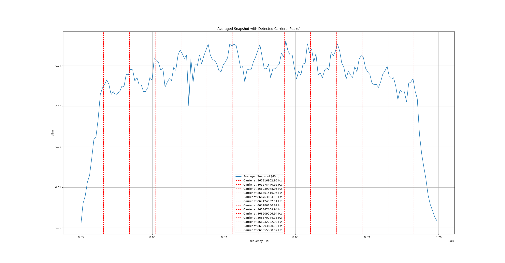

## Analysis

I will compare three methods for carrier detection below:

1. Average Snapshot Method (Noise Removal): This method involves finding the average snapshots by removing noise from each snapshot.
2. Average Snapshot Method (Noise Reduction): In this approach, noise is made less significant by applying a power function to the data.
3. Minimization Method: This method leverages the fact that all carriers are evenly spaced, allowing them to be described using a start frequency and a frequency spread. A ternary search is used to optimize the frequency spread, and a binary search is applied to optimize the start frequency.

To assess the precision of these methods, I am using the Euclidean distance to the actual carrier frequencies. The results for each method are as follows:
1. 15 837.47
2. 17 589.28
3. 17 277.75

### Analysis

1. While this method provides the best result in terms of accuracy, its drawback is the need to manually tune a threshold, which can be problematic if the signal power fluctuates over time.
2. This approach is less precise but is more robust to signals with changing power. 
3. Although more complex than the first two methods. This method exploits the fact that carriers are evenly spaced

Below is the visualization of the carrier frequencies for the third method. Notice that carriers don't match picks. In this case, minimization method is a correction method.

